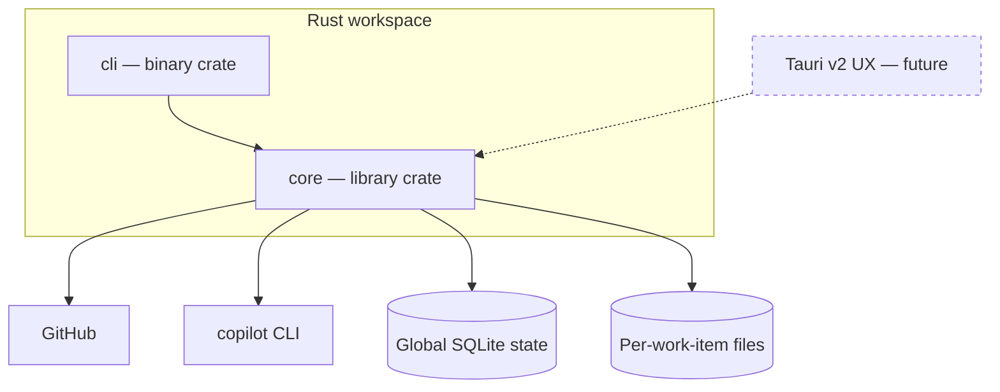

# Architecture

Quorum is split into a reusable **Core** and a thin driver. The Core is the whole
product. The **CLI** is a reference driver used to exercise the Core; the **Tauri v2 UX**
is the intended human frontend and reuses the same Core — it is a driver, never a fork of
the logic. Both frontends drive the Core through the same [contract](frontend.md).



## Workspace layout

```
Cargo.toml            # [workspace] members = ["core", "cli"]
core/                 # state machine, agents, persistence, and config
  src/lib.rs
cli/                  # thin binary: parse args, call Core, render state
  src/main.rs
```

## Responsibilities

| Layer | Owns | Does NOT own |
|-------|------|--------------|
| Core | State machine, agent orchestration, persistence, repository/worktree lifecycle, Coordinator-owned Git/GitHub delivery, config load/save, cancellation, GitHub + `copilot` invocation | Argument parsing, terminal rendering |
| CLI (reference driver) | One work item: start/resume, render live activity and status snapshots | Any business logic; multi-work-item orchestration |
| Tauri (frontend) | Windowing, launching a terminal for human intervention, multi-work-item views | Any logic not already in Core |

## Principles

- **Core is headless and deterministic** given its on-disk state; both frontends are interchangeable drivers.
- **CLI is light**: it drives exactly one work item. Listing many work items is already a
  Core capability (`Database::work_items`); presenting a multi-item view is a UX concern.
- **No logic in frontends**: anything a human would call "how Quorum works" lives in Core.
- **Registered context**: every work item is scoped to an allow-listed Git repository.
- **Typed observability**: Core emits and persists structured activity; frontends only
  choose how to render it.
- **Coordinator-only delivery**: agents cannot push or create pull requests; Core hands
  accepted work off through the explicitly selected GitHub remote without merging or
  enabling auto-merge.

See [glossary](glossary.md) for terms, [state-machine](state-machine.md) for the Core's control flow.
