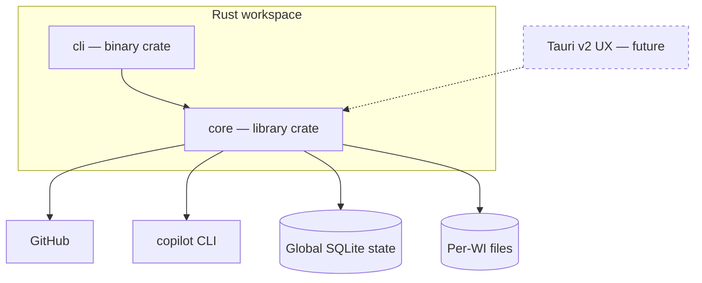

# Architecture

Quorum is split into a reusable **Core** and a thin **CLI**. A future Tauri v2 UX
reuses the same Core — it is sugar, never a fork of the logic.



## Workspace layout

```
Cargo.toml            # [workspace] members = ["core", "cli"]
core/                 # all logic: state machine, CO/PL/IM/RV, persistence, config
  src/lib.rs
cli/                  # thin binary: parse args, call Core, render state
  src/main.rs
```

## Responsibilities

| Layer | Owns | Does NOT own |
|-------|------|--------------|
| Core | State machine, agent orchestration (CO/PL/IM/RV), persistence, repository/worktree lifecycle, config load, GitHub + `copilot` invocation | Argument parsing, terminal rendering |
| CLI | One WI: start/resume, print current state + HI resume commands | Any business logic; multi-WI orchestration |
| Tauri (future) | Windowing, launching a terminal for HI | Any logic not already in Core |

## Principles

- **Core is headless and deterministic** given its on-disk state; both frontends are interchangeable drivers.
- **CLI is light**: it drives exactly one WI. Orchestrating many WIs is a future UX concern.
- **No logic in frontends**: anything a human would call "how Quorum works" lives in Core.
- **Registered context**: every WI is scoped to an allow-listed Git repository.

See [glossary](glossary.md) for terms, [state-machine](state-machine.md) for the Core's control flow.
