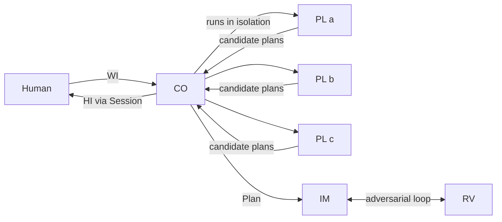

# Glossary

Every term is defined here once. Elsewhere we use the acronym.

| Term | Acronym | Definition |
|------|---------|------------|
| Work Item | WI | The unit of work Quorum processes. A local markdown file (optionally pulled from a GitHub issue), which may embed images. |
| Coordinator | CO | The orchestrator. Runs the PLs, drives convergence, runs the IM↔RV loop, and pulls humans in when needed. Owns the state machine for one WI. |
| Planner | PL | A single AI model that, in isolation, produces a candidate plan for a WI. Multiple PLs form the quorum. |
| Quorum | — | The set of PLs whose candidate plans the CO merges into one converged Plan. |
| Plan | — | The converged specification for a WI, merged from PL outputs and accepted by the CO (and optionally a human). |
| Implementer | IM | A single AI model that produces the implementation from the Plan. |
| Reviewer | RV | A different model that adversarially reviews the IM's output. IM and RV loop until RV accepts. |
| Session | — | A named `copilot` CLI session, resumable in a terminal, used to gather Human Intervention. |
| Human Intervention | HI | A point where the CO pauses autonomous progress and requires a human (intake answers, plan review, or work review). |
| Core | — | The Rust library crate implementing all Quorum logic (state machine, agents, persistence). |
| CLI | — | The Rust binary crate that drives the Core for a single WI. Light; no multi-item orchestration. |

## Roles at a glance

