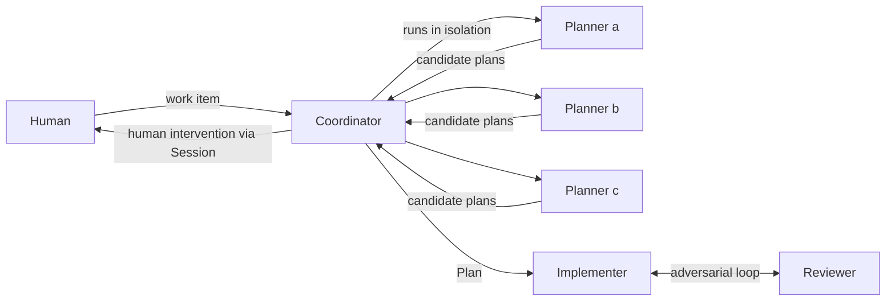

# Glossary

Every Quorum-specific term is written in full throughout the project.

| Term | Definition |
|------|------------|
| Work item | The unit of work Quorum processes. A local markdown file, optionally pulled from a GitHub issue, which may embed images. |
| Coordinator | The orchestrator. Runs the Planners, drives convergence, runs the Implementer and Reviewer loop, and pulls humans in when needed. Owns the state machine for one work item. |
| Planner | A single AI model that independently produces a candidate plan for a work item. Multiple Planners form the quorum. |
| Quorum | The set of Planners whose candidate plans the Coordinator merges into one converged Plan. |
| Plan | The converged specification for a work item, merged from Planner output and accepted by the Coordinator and optionally a human. |
| Implementer | A single AI model that produces the implementation from the Plan. |
| Reviewer | A different model that adversarially reviews the Implementer's output. The Implementer and Reviewer loop until the Reviewer accepts. |
| Session | A named `copilot` CLI session, resumable in a terminal, used to gather human input. |
| Human intervention | A point where the Coordinator pauses autonomous progress and requires a human, such as intake answers, plan review, or work review. |
| Core | The Rust library crate implementing all Quorum logic: state machine, agents, and persistence. |
| CLI | The Rust binary crate that drives the Core for a single work item. It does not orchestrate multiple work items. |
| Local Sandbox | Copilot's OS-level sandbox (`--sandbox`) that confines an agent's filesystem, network, and tool access. It is Quorum's execution-isolation boundary. |
| Idea isolation | Keeping each Planner from seeing other Planners' output so candidate plans stay independent. |
| Execution isolation | Confining an agent's filesystem, network, and tool access through the Local Sandbox so unattended runs remain safe. |

## Roles at a glance

