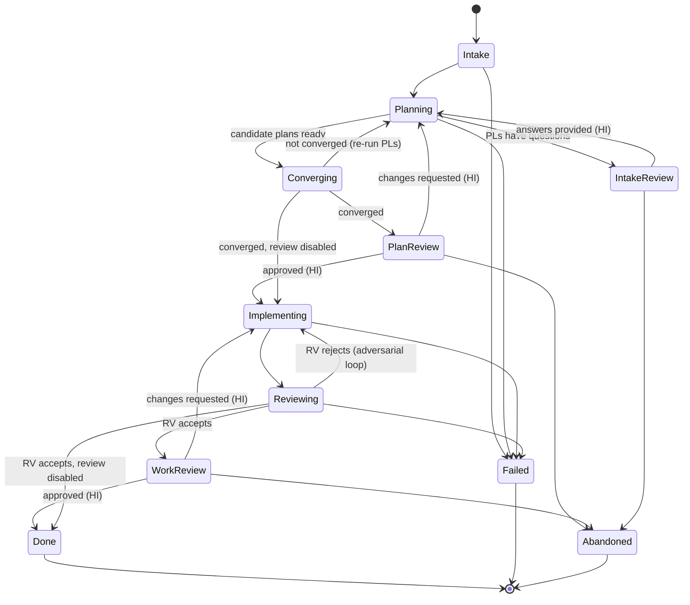

# State Machine

The CO drives one WI through this state machine. It is the backbone: [agents](agents.md),
[sessions](sessions.md), and [persistence](persistence.md) all reference these state names.

Every state is either **autonomous** (CO makes progress unattended) or **blocked**
(CO is stuck, awaiting HI). The CLI and future UX MUST surface this distinction.

## States

| State | Kind | Meaning |
|-------|------|---------|
| `Intake` | autonomous | Load the WI (local markdown or pulled from GitHub), resolve images, validate. |
| `IntakeReview` | blocked (HI) | PLs raised follow-up questions; a human answers them via a Session. |
| `Planning` | autonomous | Each PL produces a candidate plan in isolation. |
| `Converging` | autonomous | CO merges candidate plans; re-runs PLs until the Plan stabilizes (see convergence loop). |
| `PlanReview` | blocked (HI, optional) | Human reviews the converged Plan. Approve, or send back to `Planning`. |
| `Implementing` | autonomous | IM produces the implementation from the Plan. |
| `Reviewing` | autonomous | RV adversarially reviews the IM output. |
| `WorkReview` | blocked (HI, optional) | Human reviews the accepted work. Approve, or send back to `Implementing`. |
| `Done` | terminal | Work accepted. |
| `Failed` | terminal | Unrecoverable error (see [persistence](persistence.md) for retry/recovery first). |
| `Abandoned` | terminal | Human canceled the WI. |

## Diagram

## Loops

1. **Intake loop** — `Planning` → `IntakeReview` → `Planning`, until PLs have no open questions.
2. **Convergence loop** — `Planning` → `Converging` → `Planning`, until the Plan stabilizes. See [agents](agents.md) for convergence criteria.
3. **Adversarial loop** — `Implementing` → `Reviewing` → `Implementing`, until RV accepts.

`PlanReview` and `WorkReview` are optional gates (toggled in [config](config.md)); when
disabled the CO transitions straight through.

## Progressing vs. stuck

- **Autonomous** states: the WI is progressing on its own. The CLI reports the current state and last activity.
- **Blocked (HI)** states: the WI is stuck awaiting a human. The CLI prints the exact
  Session resume command (see [sessions](sessions.md)); the UX offers a one-click terminal.

Each state and every transition is persisted so the CO can resume after a crash
(see [persistence](persistence.md)).
