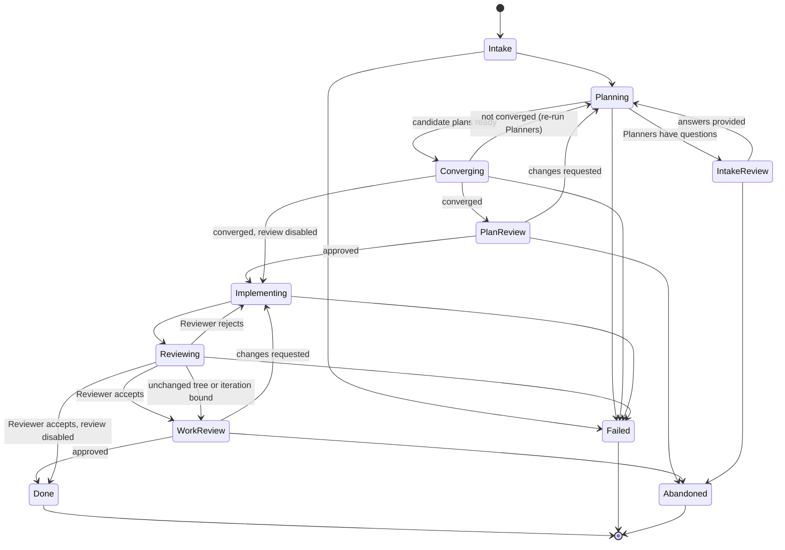

# State Machine

The Coordinator drives one work item through this state machine. It is the backbone: [agents](agents.md),
[sessions](sessions.md), and [persistence](persistence.md) all reference these state names.

Every state is either **autonomous** (the Coordinator makes progress unattended) or
**blocked** (the Coordinator is awaiting human intervention). The CLI and future UX
MUST surface this distinction.

## States

| State | Kind | Meaning |
|-------|------|---------|
| `Intake` | autonomous | Load the work item, resolve images, and validate. |
| `IntakeReview` | blocked | Planners raised follow-up questions; a human answers them through a Session. |
| `Planning` | autonomous | Each Planner produces a candidate plan in isolation. |
| `Converging` | autonomous | The Coordinator merges candidate plans and re-runs Planners until the Plan stabilizes. |
| `PlanReview` | blocked, optional | A human reviews the converged Plan. Approve, or send it back to `Planning` with optional feedback. |
| `Implementing` | autonomous | The Implementer produces the implementation from the Plan. |
| `Reviewing` | autonomous | The Reviewer adversarially reviews the Implementer's output. |
| `WorkReview` | blocked, optional | A human reviews the accepted work. Approve, or send it back to `Implementing`. |
| `Done` | terminal | Work accepted. |
| `Failed` | terminal | Unrecoverable error (see [persistence](persistence.md) for retry/recovery first). |
| `Abandoned` | terminal | A human canceled the work item. |

## Diagram

## Loops

1. **Intake loop** — `Planning` → `IntakeReview` → `Planning`, until Planners have no open questions.
2. **Convergence loop** — `Planning` → `Converging` → `Planning`, until the Plan stabilizes. See [agents](agents.md) for convergence criteria.
3. **Adversarial loop** — `Implementing` → `Reviewing` → `Implementing`, until the Reviewer accepts.
   After a rejection, equal consecutive Git tree SHAs or the configured iteration bound
   force `WorkReview`, even when the normal work-review gate is disabled.

`PlanReview` and `WorkReview` are optional gates (toggled in [config](config.md)); when
disabled the Coordinator transitions straight through.

## Progressing vs. stuck

- **Autonomous** states: the work item is progressing on its own. The CLI reports the current state and last activity.
- **Blocked** states: the work item is awaiting a human. The CLI prints the exact
  Session resume command (see [sessions](sessions.md)); the UX offers a one-click terminal.

Each state and every transition is persisted so the Coordinator can resume after a crash
(see [persistence](persistence.md)).
